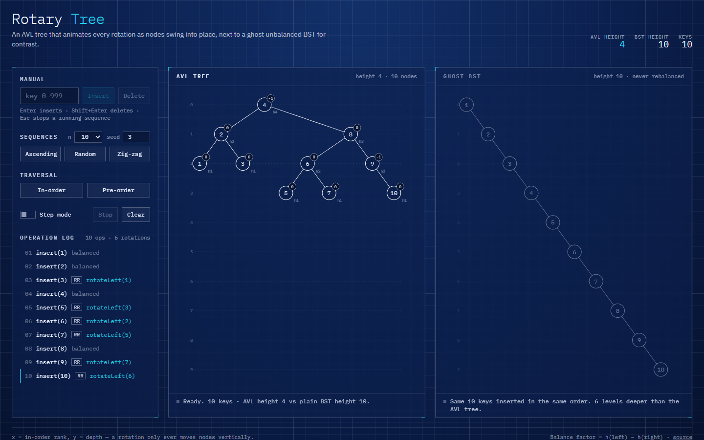
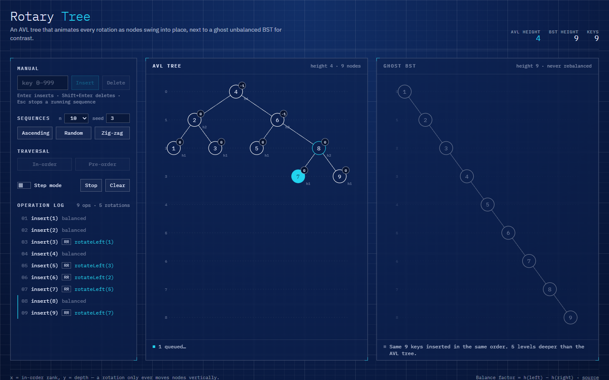

# Rotary Tree

An AVL tree that animates every rotation as nodes physically swing into place,
next to a ghost unbalanced BST for contrast.



Type 1 through 10 in order (or press **Ascending**) and watch the plain BST
degenerate into a diagonal chain while the AVL tree beside it keeps pivoting.
Each rotation is drawn as a dashed cyan arc, the pivot glows, and the node
whose balance factor went out of range flashes just before the fix.



## Features

- **AVL insert and delete** covering all four cases (LL, RR, LR, RL). Every
  rotation tweens over ~400 ms with spring easing on SVG transforms; deletes
  that cascade show one rotation at a time.
- **Balance factor badge and height on every node.** A badge turns red when
  `|bf| > 1`, and the violating node flashes before it is rebalanced.
- **Ghost panel.** The same operations applied to a never-rebalanced BST,
  rendered at 40 % opacity on the right and sharing the AVL panel's columns, so
  the height difference is an honest side-by-side.
- **Operation log** listing every insert/delete with its rotations
  (`rotateLeft(30)`) and case tag. Click any row to rewind to just before it and
  replay it.
- **Bulk sequences:** ascending, seeded random (Fisher–Yates over mulberry32)
  and zig-zag (`1, n, 2, n-1, …`, which drives the double rotations), plus
  manual key input. `?seq=asc|rand|zig&n=10&seed=3` autoplays a sequence.
- **Step mode.** Pauses after the plain BST step, before rebalancing, and asks
  you to predict the case. Your guess is recorded in the log.
- **Traversal ticker.** In-order or pre-order, with a cursor walking the tree
  and a chip strip filling in below it.
- Keyboard-first: Enter inserts, Shift+Enter deletes, Esc stops a running
  sequence. Works down to ~380 px. Respects `prefers-reduced-motion`.

## How it works

The core (`src/tree/`) is an **immutable AVL tree**. A node is
`{ key, left, right, height }`, and every mutation path-copies from the root,
so an old tree stays a valid snapshot. `insert` and `remove` return an
`OpResult` with the new tree, the rotations as strings (`rotateRight(30)`), and
a list of **phases**: the tree right after the plain BST step (possibly
unbalanced, with the deepest violator identified) followed by one snapshot per
rotation. The UI is nothing more than a player that renders those snapshots in
order.

Rebalancing walks the changed path bottom-up. At the first node whose balance
factor `h(left) − h(right)` leaves `[-1, 1]`, it looks at the heavy child's
balance to pick a case, then applies one or two rotations by path-copying down
to the pivot and swapping it with its child:

```
insert 30, 10, 20 (LR case)

   30            30             20
  /      →      /       →      /  \
10            20             10    30
  \          /
   20      10
        rotateLeft(10)   rotateRight(30)
```

Layout is the trick that makes the animation cheap. Each node's **x is its
in-order rank** and **y is its depth**. A rotation never changes in-order, so
during a rebalance nodes only ever move vertically — and because the ghost BST
holds the same keys, both panels share identical columns. React keys every
`<g>` by node value, so when a node's position changes the same element gets a
new `transform`, and a CSS transition with a spring `cubic-bezier` swings it
into place. Edges are unit lines scaled and rotated with the same transition,
so they follow the nodes without any animation library. The rotation arc is a
true circular sweep: the pivot's old and new spots and the riser's old and new
spots all lie on the circle centred on their shared edge, so one `A` path
segment per node draws the swing.

## Run

```sh
npm install
npm run dev        # local dev server
npm run build      # tsc -b && vite build → dist/
npm test           # vitest run
```

Tests cover the four rotation cases with exact event sequences, the phase
snapshots step mode relies on, deletes that cascade, a 1000-key seeded shuffle
against the `1.44·log₂(n+2)` AVL height bound, a randomised insert/delete soak
checked against a sorted set, layout ranks and the sequence generators.

## Tech

React 19, TypeScript (strict, `erasableSyntaxOnly`), Vite 8, Tailwind CSS 4,
Vitest 5, IBM Plex Mono / Sans via `@fontsource`. No animation or tree
libraries — the AVL, layout and SVG tweening are all in this repo.

## License

MIT © 2026 Jafn
